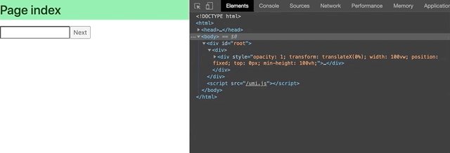

# Page Transition Animation on UmiJS ^3.2.4

This repo shows how to do page transition animation on UmiJS ^3.2.4 using React-Transition-Group and react-spring



It replaces the current UmiJS's Switch component with React-Router's Switch component so that location from props will be used instead of from router context.

Links:

- <https://github.com/umijs/umi/blob/master/packages/renderer-react/src/renderRoutes/Switch.tsx>

- <https://github.com/umijs/umi/blob/master/packages/runtime/src/index.ts>

## React Transition Group

```javascript
  // layout/index.tsx

  // Create new switch with react-router so that the switch component uses location from props instead of router context
  const newSwitch = (
    <Switch location={location}>{children.props.children}</Switch>
  );

  // Example using React-Transition-Group
  
  return (
    <TransitionGroup
      childFactory={(child: any) =>
        React.cloneElement(child, {
          classNames: 'forward',
        })
      }
    >
      <CSSTransition key={location.pathname} timeout={2000}>
        {newSwitch}
      </CSSTransition>
    </TransitionGroup>
  );
```

## react-spring

```javascript
// layout/index.tsx

  // Create new switch with react-router so that the switch component uses location from props instead of router context
const newSwitch = (
    <Switch location={location}>{children.props.children}</Switch>
  );

// Example using react-spring useTransition Hook
const transitions = useTransition(
    newSwitch,
    location.pathname,
    history.action === 'PUSH' ? foward : back,
  );

  return (
    <div>
      {transitions.map(({ item, key, props: style }) => {
        return (
          <animated.div
            key={key}
            style={{
              ...style,
              width: '100vw',
              position: 'fixed',
              top: 0,
              minHeight: '100vh',
            }}
          >
            {item}
          </animated.div>
        );
      })}
    </div>
  );
```

## Getting Started

Install dependencies,

```bash
$ yarn
```

Start the dev server,

```bash
$ yarn start
```
